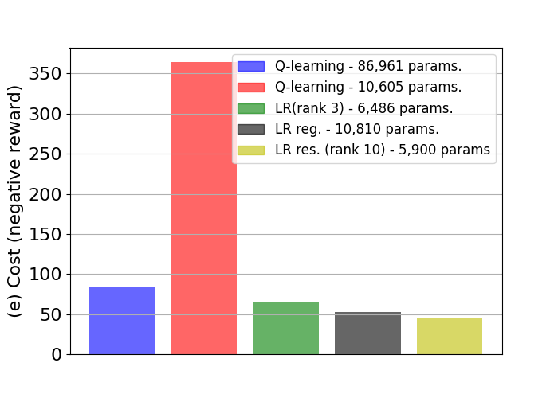

# Low-rank State-action Value-function Approximation

by
Sergio Rozada,
Victor Tenorio,
and Antonio G. Marques

This code belongs to a paper that has been published in *EUSIPCO 2021*.

> The associated paper presents low-rank matrix decomposition models for value-based methods. They leverage matrix-completion techniques in the Q(s, a) matrix. They drastically reduce the computational complexity relative to classical Q-learning.

    

*Median cost (negative return) of various Q-learning, and LR setups
 low in the classical pendulum environment.*

## Abstract

> Value functions are central to Dynamic Programming and Reinforcement Learning but their exact estimation suffers from the curse of dimensionality, challenging the development of practical value-function (VF) estimation algorithms. Several approaches have been proposed to overcome this issue, from non-parametric schemes that aggregate states or actions to parametric approximations of state and action VFs via, e.g., linear estimators or deep neural networks. Relevantly, several high-dimensional state problems can be well-approximated by an intrinsic low-rank structure. Motivated by this and leveraging results from low-rank optimization, this paper proposes different stochastic algorithms to estimate a low-rank factorization of the Q(s, a) matrix. This is a non-parametric alternative to VF approximation that dramatically reduces the computational and sample complexities relative to classical Q-learning methods that estimate Q(s,a) separately for each state-action pair. 

## Software implementation

This repository contains the code of the paper *"Low-Rank State-Action Value-Function Approximation"*. The code is organized in three directories:
* **frozenlake:** code with the simulations relating FrozenLake environment.
* **pendulum:** code with the simulations relating Pendulum environment.
* **acrobot:** code with the simulations relating Acrobot environment.
* **figures:** key figures obtained from the simulations.

In the repositories they can be found two folders with:
* **experiments:** json files with each experiment run included in the paper.
* **results:** pickle files with the data obtained from training used to build the figures and the results.

Training scripts vary depending on the environment, but there are four types of scripts that are relevant:
* **utils.py:** script with the implementation of Q-learning, low-rank and linear-based architectures learning, apart from test utils and more.
* **q_learning.py:** script that loads and runs Q-learning experiments.
* **deep_q_learning.py:** script that loads and runs Deep Q-learning experiments.
* **low_rank.py:** script that loads and runs low-rank experiments.
* **test.py:** script that takes the training outputs and build up the results. The reviewer may want to run this script in order to obtain the graphs and figures available in the paper.

## Getting the code

You can download a copy of all the files in this repository by cloning the
[git](https://github.com/sergiorozada12/low-rank-rl) repository:

    git clone https://github.com/sergiorozada12/low-rank-rl.git

or [download a zip archive](https://github.com/sergiorozada12/low-rank-rl/archive/refs/heads/master.zip).
